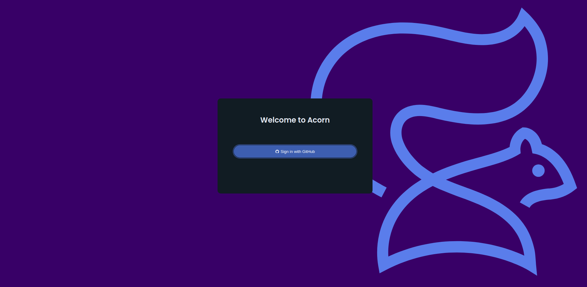
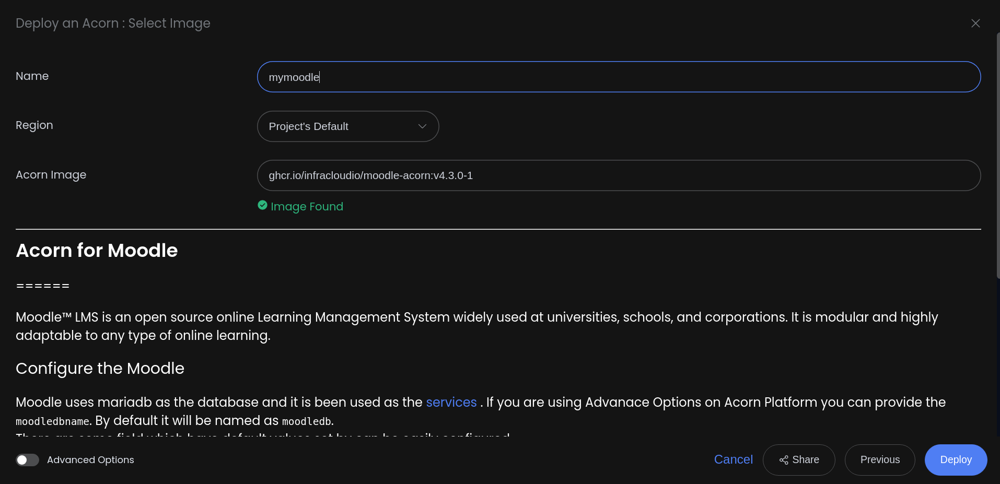
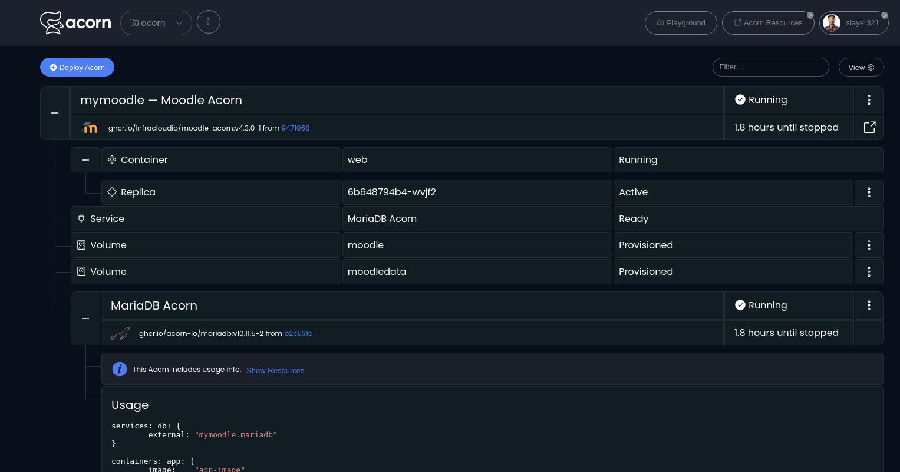
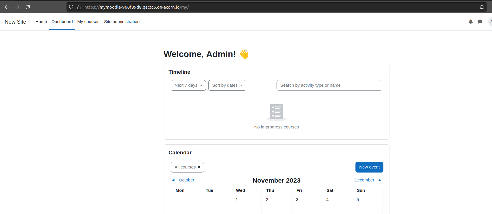
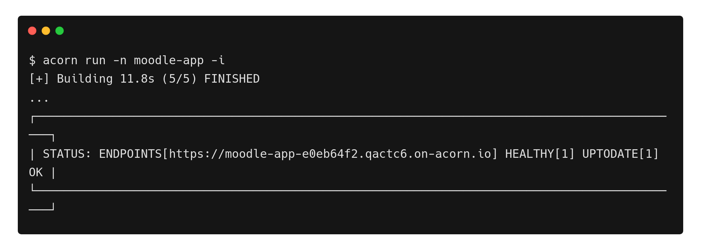

# Deploying Moodle on Acorn

[Moodle™ LMS](https://moodle.org/) is an open source online Learning Management System widely used at universities, schools, and corporations. It is modular and highly adaptable to any type of online learning.

[Acorn](http://www.acorn.io) opens exciting possibilities for hosting Moodle, a globally adopted learning management system. Renowned for its robust features, Moodle is chosen by educators worldwide. Deploying Moodle on Acorn provides a cloud-native environment with a free sandbox accessible to anyone with a GitHub account. To deploy on Acorn, define your application with an [Acornfile](https://docs.acorn.io/reference/acornfile), generating a deployable Acorn Image. This tutorial walks through provisioning a sample Moodle Application on the Acorn platform.

If you want to skip to the end, just click the button below to launch the app immediately in a free sandbox environment. All you need to join is a GitHub ID to create an account.

[](https://acorn.io/run/ghcr.io/infracloudio/moodle-acorn:v4.%23.%23-%23?ref=samkulkarni20)

If you want to follow along, I’ll walk through the steps to deploy Moodle using Acorn.

_Note: Everything shown in this tutorial can be found in [this repository](https://github.com/infracloudio/moodle-acorn)_.

## Pre-requisites

- Acorn CLI: The CLI allows you to interact with the Acorn Runtime as well as Acorn to deploy and manage your applications. Refer to the [Installation documentation](https://docs.acorn.io/installation/installing) to install Acorn CLI for your environment.
- A GitHub account is required to sign up and use the Acorn Platform.

## Acorn Login
Login to the [Acorn Platform](http://beta.acorn.io) using the GitHub Sign-In option with your GitHub user.


After the installation of Acorn CLI for your OS, you can login to the Acorn platform.
```
$ acorn login beta.acorn.io
```

## Deploying the Moodle Application
In this tutorial we will deploy Moodle.

In the Acorn platform, there are two ways you can try this sample application.
1. Using Acorn platform dashboard.
2. Using CLI

The first way is the easiest one, where, in just a few clicks, you can deploy the Moodle application on the platform and start using it. However, if you want to customize the application, use the second option.

## Deploying Using Acorn Dashboard

In this option you use the published Acorn application image to deploy the Moodle application in just a few clicks. It allows you to deploy your applications faster without any additional configurations. Let us see below how you can deploy Moodle app to the Acorn platform dashboard.

1. Log in to the [Acorn Platform](https://acorn.io/auth/login)  using the GitHub Sign-In option with your GitHub user.
2. Select the “Create Acorn” option.
3. Choose the source for deploying your Acorns
   3.1. Select “From Acorn Image” to deploy the sample Application.


   3.2. Provide a name "My Moodle”, use the default Region and provide the URL for the Acorn image and click Create.
   ```
   ghcr.io/infracloudio/moodle-acorn:v4.#.#-#
   ```


_Note: The App will be deployed in the Acorn Sandbox Environment. As the App is provisioned on AcornPlatform in the sandbox environment it will only be available for 2 hrs and after that it will be shutdown. Upgrade to a pro account to keep it running longer_.

4. Once the Acorn is running, you can access it by clicking the Endpoint or the redirect link.
   4.1. Running Application on Acorn
   
   4.2. Running Moodle
   


## Deploying Using Acorn CLI
As mentioned previously, running the acorn application using CLI lets you understand the Acornfile. With the CLI option, you can customize the sample app to your requirement or use your Acorn knowledge to run your own Moodle application.

To run the application using CLI you first need to clone the source code repository on your machine.

```
$ git clone https://github.com/infracloudio/moodle-acorn.git
```
Once cloned here’s how the directory structure will look.

```
.
├── Acornfile
├── LICENSE
├── moodle.svg
├── README.md
└── tutorial.md

```

### Understanding the Acornfile

We have the Moodle Application ready. Now to run the application we need an Acornfile which describes the whole application without all of the boilerplate of Kubernetes YAML files. The Acorn CLI is used to build, deploy, and operate Acorn on the Acorn cloud platform.  It also can work on any Kubernetes cluster running the open source Acorn Runtime. 

Below is the Acornfile for deploying the Moodle app that we created earlier:

```
args: {
   database_type: "mariadb"
   mariadbname: "moodledb"
   postgresdbname: "postgresdb"
   ...
   moodle_site_name: "New Site"
   moodle_lang: "en"
}

localData: {
   mariadb: {
      services: mariadb: {
      image: "ghcr.io/acorn-io/mariadb:v#.#.#-#"
      serviceArgs: {
      dbName: args.mariadbname
         }
      }
   },
   postgres: {
      services: postgres:{
      image: "ghcr.io/acorn-io/postgres:v#.#-#"
      serviceArgs: {
      dbName: args.postgresdbname
         }
      }
   }
}
std.ifelse(args.database_type == "mariadb",localData.mariadb,localData.postgres)

containers: {
   web: {
      image: "docker.io/bitnami/moodle:4.3"
      ports: {
      publish: "80:8080/http"
      }
      env: {
      ...
      MOODLE_PASSWORD: args.moodle_password
      MOODLE_EMAIL: args.moodle_email
      MOODLE_SITE_NAME: args.moodle_site_name
      MOODLE_LANG: args.moodle_lang
      }
      dirs: {
      "/bitnami/moodle": "volume://moodle"
      "/bitnami/moodledata": "volume://moodledata"

      }
   }
}

volumes: {
   moodle: {size: "2G"}
   moodledata:{size: "2G"}
}
```
There are 2 requirements for running Moodle Application
- Application Itself
- DB

The above Acornfile has the following elements:

- **Args**: Which is used to take the user args.
- **Localdata**: Using this Field we are specifying both the Database that Moodle can use. 
- **Services**: Here we're using the [MariaDB](https://github.com/acorn-io/mariadb) and [Postgres](https://github.com/acorn-io/postgres)service that is built into Acorn as an [Acorn Service](https://docs.acorn.io/reference/services).
- **Containers**: We define a single container named web and define the following configurations:
  - **image**: Moodle Image
  - **ports**: port number the application is listening on and we are also specifying [publish field](https://docs.acorn.io/reference/acornfile#ports) which will give the url to access the application.
  - **env**: In the env section we are providing all the env variables which the application will be using.
  -  **dirs**: Here we are setting two volumes that moodle uses.
- **Volumes**: Volmes which we are referring inside the containers dirs field

### Running the Application
We have already logged in using Acorn CLI now you can directly deploy applications on your sandbox on the Acorn platform. Run the following command from the root of the directory.

```
$ acorn run -n moodle-app -i
```

Below is what the output looks like.



## Moodle Application

While understanding the Acornfile we saw the Args field which takes different user input though which we can make out moodle configurable. Some of the fields that you can specify is `username`, `password`, `site name` etc. 

Once we provide all the details and our moodle application is running below is what our moodle dashboard looks like once we loged in.


## What's Next?

1. The App is provisioned on Acorn Platform and is available for two hours. Upgrade to Pro account for anything you want to keep running longer.
2. After deploying you can edit the Acorn Application or remove it if no longer needed. Click the Edit option to edit your Acorn's Image. Toggle the Advanced Options switch for additional edit options.
3. Remove the Acorn by selecting the Remove option from your Acorn dashboard.

## Conclusion
In this tutorial we show how we can use the Acornfile and get our Moodle application up and running.
